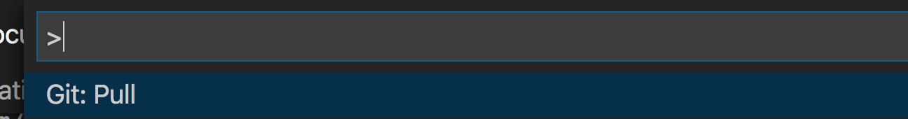
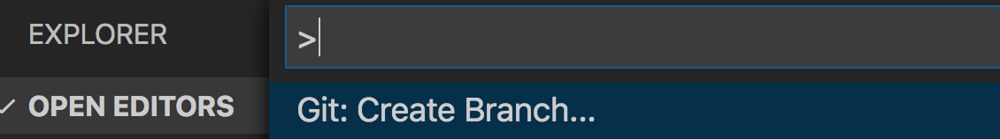
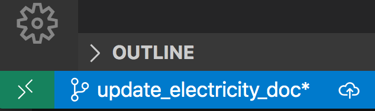

# Contact
<a href="mailto:contact@fithome.life">Email Us</a>  

# Overview of the FitHome Project
[Overview](Home.md)

# Contributing to FitHome's Wiki
It is wonderful that you will help us with documentation.  THANK YOU.  Great documentation is critical to a project but sadly often lacking.  Also, it is only as accurate as the expertise of the person writing it.  We do what we can, but together we can do much better.  
  
The goal of this page is to get you started on collaborating on the documenation.
# Getting Started
The editing tool we use is [VS Code](https://code.visualstudio.com/).  This might sound surprising if you are used to blog editing tools like those for WordPress.  However, our project revolves around GitHub.  The implications of revolving around GitHub are:
- the Wiki pages use markdown.
- the check-in/check-out process follows the steps of any GitHub project.  
## Install the Editor
The first step is to install [VS Code](https://code.visualstudio.com/).  Follow the download actions that are available for your OS on the link.  
## Clone the Wiki
We'll use VS Code to help us clone the wiki.
Open an instance of Visual Studio Code.

Press Ctrl+Shift+P to show the Command Palette. The Command Palette provides an easy and convenient way to access a wide variety of tasks.

Find the Git: Clone command. It may help to type “Git” to bring it to the shortlist.  
  
The FitHome wiki url for cloning is  https://github.com/BitKnitting/FitHome.wiki.git.  

Type the wiki url into the input text field.  
  
You will be asked to choose a directory to store the wiki pages.  
## Edit the Pages
You'll find the pages as >page name<.md .  md files are files where the editing behavior (underlines, bold, lists, etc.) is determined by [markdown](https://github.com/adam-p/markdown-here/wiki/Markdown-Cheatsheet).  If you are not familiar with using GitHub, you may want to browse through the wiki documentation, and also view [a cheat sheet](https://github.com/adam-p/markdown-here/wiki/Markdown-Cheatsheet).
## Push the Pages
Now it is time to push the pages to the FitHome repo.  Before doing this...
### Sync Your Local Files
There is a good chance changes have been made to files since you cloned the project.  Before you push pages to the github repo, sync what is in the github repo to your local copy.  To do this, we first bring up VS Code's command pallete by pressing Ctrl+Shift+P.  Find the Git: Pull  command.
  
and execute the command.  

Now that our local files are up to date with the GitHub repo, we can push our changes.
### Create a Branch
Before pushing up changes, create a new branch. This way, your edits don't clobber the main branch.  To do this, execute the Create Branch command. You'll need to give the branch a name, e.g.: updated_electricity_doc

   

Verify you are working from this branch by checking the bottom left area of VS Code.  

