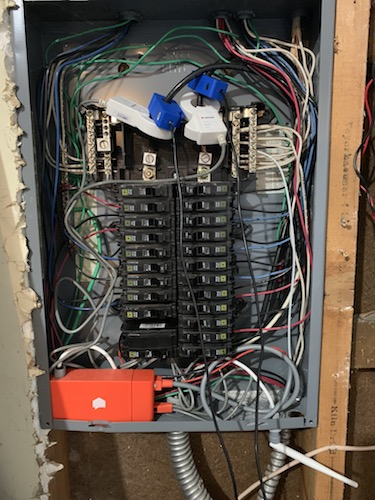
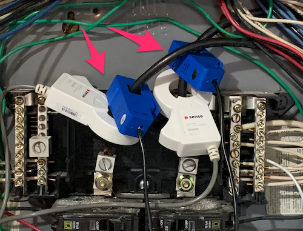
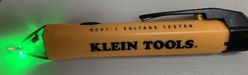
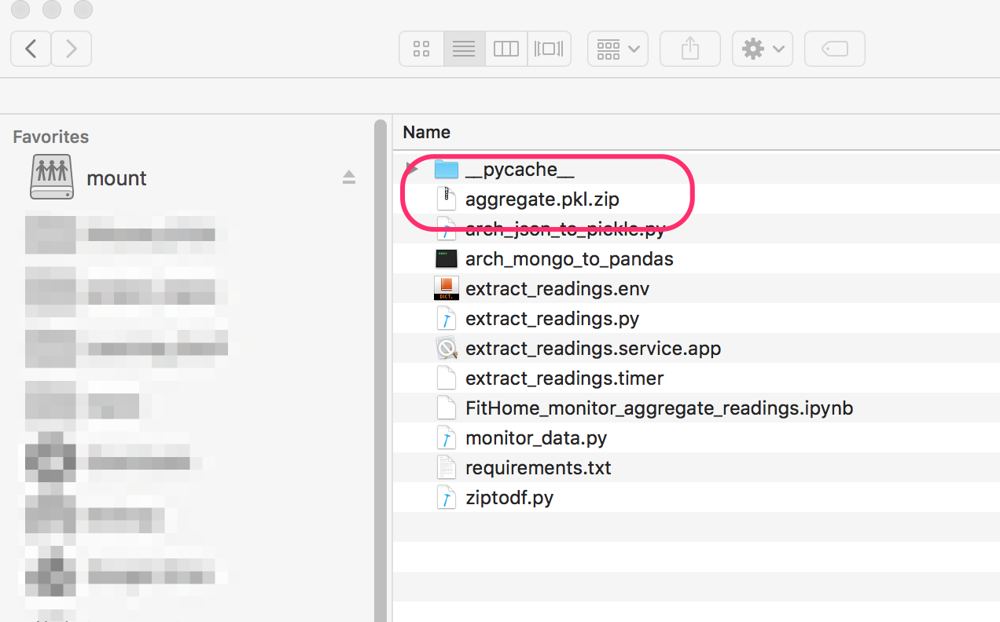

# Contact
<a href="mailto:contact@fithome.life">Email Us</a>  
# Document Goal
The goal of this document is to get you set up and running your own home electricity monitoring system.

# Overview

The Electricity Monitor communicates to a Raspberry Pi over SPI to read and then send active and reactive aggregate power readings to the Raspberry Pi.  Readings are stored within the Raspberry Pi's mongo DB.  

  
  
The readings can then be used by analytical packages such as Pandas, Keras - or whatever you want to use! - to learn more about how a home's energy is used.
# Thanks to Those That Went Before
There is _so much_ prior work that made it easier to evolve the atm90e32 micropython library.  Efforts include:  
* Tisham Dhar's [atm90e26 Arduino library](https://github.com/whatnick/ATM90E26_Arduino).    
* The [atm90e26 Circuit Python library I wrote](https://github.com/BitKnitting/HappyDay_ATM90e26_CircuitPython).
* Circuit Setup's [atm90e32 Arduino library](https://github.com/CircuitSetup/Split-Single-Phase-Energy-Meter/tree/master/Software/libraries/ATM90E32).
# GitHub
[Our GitHub](https://github.com/BitKnitting/FitHome_monitor)
# For Collaborators
We are thrilled you want to collaborate with us on this project.  Welcome!  To get started, please follow the steps outlined [in this medium post on GitHub collaboration](https://medium.com/faun/collaborating-on-github-22fd5886fce).     

_PLEASE evolve the documentation if it can be improved. This will benefit us all!_

# Required Hardware
The hardware we use to gather readings include:
- Two Current Transformers (CTs) that work for your power lines (see the discussion on Current Transformers below).
- [CircuitSetup's Split Single Phase Real Time Whole House Energy Meter (v 1.4)](https://circuitsetup.us/index.php/product/split-single-phase-real-time-whole-house-energy-meter-v1-4/) is the breakout board we use.   This breakout board is based on the [ATM90e32 chip](https://www.microchip.com/wwwproducts/en/atm90e32as).

Besides the monitor, the breakout board needs a [9V AC Transformer](https://amzn.to/2t7AUro).  What transformer you use becomes important because there are calibration steps (see the Calibration section below) that require different "numbers" depending on the transformer. 
- A raspberry Pi where the collected readings are stored within the Raspberry Pi's mongodb.  We are currently using a Raspberry Pi 3 B +.  We just ordered a Pi Zero W to see if that would work since it is smaller and 1/3 the price.  The Pi 3 B+ has done great for this prototype.
- A power cord for the Raspberry Pi.  We order whatever is recommended since not getting the voltage/current right will cause the board to die (a probably not painful death).

- "Standard" DIY proto stuff that we all most likely already have.  This includes a green LED along with associated resistor, wires, and a breadboard.

## More about CTs

Aggregate power readings are measured by attaching Current Transformers to the power lines within a home's breaker box.  Our breaker box is located in the garage.  We have two electricity monitors hooked up.  One is the Sense monitor (the red box uses the white CTs), the other is this project (using the blue CTs). 

Go to your breaker panel and take a picture similar to the picture shown here.  

Picture 1:  
   
_Overview picture of breaker box_ 

Then post the image to our GitHub.  This way, we can learn more about how houses have their electricity installed.  By doing so, we can make this project more robust and accomodating to different installations.  

### House Wiring
You'll need to know what your house is wired for.  As we note below, many homes are wired for 100 Amp service.  As a home's electricity use increased, the service increased to 200 Amps.  Read about the characteristics of a CT below and figure out what CT model will work with your power lines.  Send the info on the CT you will be using to GitHub so we can better understand what we are building.

### Current Transformers

Current Transformers (CTs) are our "ears" into how devices are using power within our home.  You can see the CTs on our power line.
  
Each of our lines has two CTs - one white, one blue.  The white ones come with the Sense monitor.  The blue ones are the ones we use for this project.  

The CT model we use is [the SCT-013-000 CT](/https://learn.openenergymonitor.org/electricity-monitoring/ct-sensors/yhdc-sct-013-000-ct-sensor-report).  Our home's power lines are 100A service.  You may have 200A service.  That will require a different CT.

The info below should help you get a better idea of CTs and what works for 100A versus 200A services.

### CT Installation
Installation is the step where it is important to know that most people would recommend an electrician to install the CTs.  This is because = as you can imagine - the amount of voltage and current pouring through the lines WILL kill you because skin is a great conductor of electricity.

I chose to install the CTs myself.  While my family thought this was foolish, I researched and decided:
- I'm snapping a plastic "thing" (CT) around a heavily cabled line.
- For added protection, I turned off the power before putting on the CTs.  Just to make sure, I double checked the power was off with a voltage detector  
  


Or you can pay an electrician to install.

Your choice.

### Characteristics of the CT
 The characteristics of a CT to be considered when sourcing include:
 * The amount of Amp Service.  This is important because it dictates the hole diameter of the CT.  Many homes are wired for 100 Amp service.  As a homes electricity use increased, the service increased to 200 Amps.[From this article _Understanding Your Home's Electrical Load_](https://www.bhg.com/home-improvement/electrical/how-to-check-your-homes-electrical-capacity/) _Different homes need different amp services. A 60-amp service is probably inadequate for a modern home. A 100-amp service is good for a home of less than 3,000 square feet that does not have central air-conditioning or electric heat. A home larger than 2,000 square feet that has central air-conditioning or electric heat probably needs a 200-amp service._  According to [Bill Thompson of the Open Energy Monitor Project](https://community.openenergymonitor.org/t/ct-hole-diameter-for-north-america/5149), _US homes built before the late 60s were wired with Copper and typically had 100 Amp service, which used AWG 0 copper...Sometime in the late 60s to early 70s, Copper Service Entrance Wires were replaced by Aluminum. Since Aluminum has more resistance per foot than Copper, the equivalent Aluminum wire is two gauges larger than its Copper counterpart. About that same time, 200 Amp service became the norm._  
 * The wire gauge.  The Outside Diameter of the wire gauge determines how large the diameter of the CT clamp must be.  As Bill noted, wires could be copper or aluminum, or copper-clad aluminum.  More aluminum, more current - the wider the diameter.  
   * [100 Amp Service uses 1/0 AWG](https://community.openenergymonitor.org/t/ct-hole-diameter-for-north-america/5149/3) = [12.08 mm](https://lugsdirect.com/Wire_Insulation_Outside_Diameter_Thickness_600V.html).  
   * 200 Amp Service uses (up to?) 2/0 - 4/0 AWG.  [4/0 AWG has an Outside diameter of 16.04mm](https://lugsdirect.com/Wire_Insulation_Outside_Diameter_Thickness_600V.html).  
* Whether the burden resistor is included.  This design assumes the CT __does not__ include the burden resistor.  I.e.: it's output is a current and not a voltage.  
* The ratio of I(in) : I(out)  
* The inclusion of a zener diode.  This is a terrific safety measure to make sure when the CT is clamped on, the circuit is not open.    
### Our Choice of Current Transformers 
 Two Current Transformers (CTs) are needed to get current readings on the two 120V lines.
 #### 100 Amp   
  We'll be using [the SCT-013-000 CT](/https://learn.openenergymonitor.org/electricity-monitoring/ct-sensors/yhdc-sct-013-000-ct-sensor-report) for 100A homes.  It is popular with DIY home energy monitors.  There are two numbers of interest in the [YHDC SCT-013-000 datasheet](http://statics3.seeedstudio.com/assets/file/bazaar/product/101990029-SCT-013-000-Datasheet.pdf):    
* The diameter of the clamp opening - 13 mm  
* The I(OUT) - 50 mA  
As Robert Wall of [the Open Energy Monitor project](https://openenergymonitor.org/) noted to me _...the manufacturer will tweak the number of secondary turns to give the best accuracy overall.  The ratio of a c.t. is __ALWAYS__ specified as a ratio of two currents, the rated primary current to the corresponding secondary current. So your SCT-013-000 is __100 A : 50 mA__._ 
#### 200 Amp
TBD: We'll know what to use as the project progresses. 

At this point, you should  know which CTs to use, and hopefully ordered two!

We've got our hardware.  Time to wire the energy monitor to the Raspberry Pi.
# Set up the Rasp Pi
We've got our Rasp Pi.  Time to install the OS and configure.  We document the steps on our [Raspberry Pi page](https://github.com/BitKnitting/FitHome/wiki/RaspPi).
# Enable SPI
SPI needs to be enabled on the Rasp Pi.  
- Start an `ssh` session.
- `sudo raspi-config`
- Go to `Interfacing Options`, choose SPI, choose Enable.

# Set up FitHome_monitor Git repo
  
Now that the Rasp Pi has been configured, let's get the python code used to talk with the energy monitor up and running.
- Create a projects directory on your Rasp Pi.
- Go into the projects directory and clone [the FitHome monitor repo](https://github.com/BitKnitting/FitHome_monitor).  We can see our git remote has been setup:  
```
$ git remote -v
origin	https://github.com/BitKnitting/FitHome_monitor.git (fetch)
origin	https://github.com/BitKnitting/FitHome_monitor.git (push)
``` 

- Go into the FitHome_monitor directory and create a [Python Virtual Environment](https://docs.python.org/3/tutorial/venv.html). E.g.:  
```
python3 -m venv venv --prompt FH_monitor
```
creates a virtual environment in the venv directory.  When the venv is activated, the prompt will be FH_monitor.  Now that the venv is installed, activate, e.g.:  
```
source venv/bin/activate
```
- Install Python packages (stuff like everything needed for [Blinka](https://learn.adafruit.com/circuitpython-on-raspberrypi-linux/circuitpython-raspi))using `pip install -r requirements.txt`.
# Access Project through VS Code
Follow the steps outlined in the section on [Remote VS Code](RaspPi.md)
# Getting to Blinka
Run [blinkatest.py](https://github.com/BitKnitting/FitHome_monitor/blob/master/blinkatest.py). 
```
(venv) pi@raspberrypi:~/projects/FitHome_monitor $ python3 blinkatest.py
Hello blinka!
Digital IO ok!
SPI ok!
done!
```
# Other SPI Tests
- [simple_read.py](https://github.com/BitKnitting/FitHome_monitor/blob/master/simple_read.py)
- [simple_write.py](https://github.com/BitKnitting/FitHome_monitor/blob/master/simple_write.py)
- [simple_atm90e32_test.py](https://github.com/BitKnitting/FitHome_monitor/blob/master/simple_atm90e32_test.py)
# Wire the Rasp Pi to the Energy Monitor
We'll wire:
- SPI between the two boards.
- a Red and Green LED onto the Rasp Pi.  
## SPI Pins on Rasp Pi
We've tried this on the Rasp Pi 3 B+, Zero W, 3 BV1.2... 
  
The diagram below points out the Rasp Pi 3B+'s pinout:

- MOSI: pin 19
- MISO: pin 21
- CLK:  pin 23
- GND: pin 25
We'll use GPIO 5 (pin 29) for CS, noting in the [Blinka documentation](https://learn.adafruit.com/circuitpython-on-raspberrypi-linux/spi-sensors-devices),
_The upshot here is basically never connect anything to CE0 (or CE1 for that matter). Use whatever chip select pin you define in CircuitPython and just leave the CE pins alone, it will toggle as if it is the chip select line, completely on its own, so you shouldn't try to use it as a digital input/output/whatever._
- Wire the MOSI, MISO, SCLK, GND, CS lines from the Rasp Pi to the Energy monitor.


# Test SPI
Run [atm90e32_spi_test.py](https://github.com/BitKnitting/FitHome_monitor/blob/master/atm90e32_spi_test.py).  It is a simple SPI read.  Here is an image of the traffic from our logic analyzer:
 
We know at least SPI read is working correctly.

# Getting to Power Readings
The [atm90e32 class](https://github.com/BitKnitting/FitHome_monitor/blob/master/RaspPi/atm90e32/atm90_e32_pi.py) holds the code that provides easy access to the energy monitor.

## The atm90e32 Python Class
The class:
- initializes the monitor by setting the calibration properties.  Calibration properties differ depending on the CT and power supply that is being used with the moniter (see below).
- gets the power readings.

### Calibration 
We need to calibrate prior to using the library.  The default values are discussed in [Circuit Setup's documentation](https://github.com/CircuitSetup/Split-Single-Phase-Energy-Meter#calibration).  
  
We use the default values for:  
```
lineFreq = 4485  # 4485 for 60 Hz (North America)
PGAGain = 21     # 21 for 100A (2x), 42 for >100A (4x)
```
What is left to calibrate are the voltage and current gain values.  These are important, because they can cause havoc with the accuracy of the voltage, current, power readings.

It is more likely the voltage readings will need calibration than the current.  
### Voltage Calibration
The gain value is tied to the transformer we are using.  We decided to standardize on the [Jameco 9V power supply, part no. 157041](https://www.jameco.com/shop/ProductDisplay?catalogId=10001&langId=-1&storeId=10001&productId=157041).  The default voltage gain for a 9V AC transformer was 42080.  With this setting for voltage gain, our readings were over 15 watts higher than what the actual voltage was.  

To determine the actual voltage, we used the extremely useful [Kill-A-Watt](https://amzn.to/2Mcjkt7).

To calibrate the voltage gain, we used the formula/info in [the app note](https://github.com/BitKnitting/energy_monitor_firmware/blob/master/docs/Atmel-46103-SE-M90E32AS-ApplicationNote.pdf) _see section 4.2.6 Voltage/Current Measurement Calibration where it discusses using existing voltage gain_

where:
- reference voltage = reading from Kill-A-Watt
- voltage measurement value = the reading for voltage we got from initializing the atm90e32 instance with the voltage gain value and reading the `line_voltageA` property.

new `VoltageGain` = reference voltage/voltage measurement * current voltage gain

e.g. using a different 9V transformer:
- Kill-A-Watt shows V = 121.5
- reading shows voltage at 117.5
- current `VoltageGain` is 36650

new `Voltage Gain = 121.5/117.5*36650 = 37898`

Calculate the value, and change the `VoltageGain` to the calculated value.
### Current Calibration
We found the default current gain gave current readings close to what we got with the Kill-A-Watt.  Because it was easy to do so, we set the `CurrentGainCT1` and `CurrentGainCT2` values to our calculation, using the current readings in place of the voltage readings as discussed in the app note.
# Main Code
The main code is in [ReadAndStore.py](https://github.com/BitKnitting/FitHome_monitor/blob/master/ReadAndStore.py)
# Systemd Service
We use [systemd](https://en.wikipedia.org/wiki/Systemd) to run ReadAndStore.py in the background on our Rasp Pi.  The file is [ReadAndStore.service](https://github.com/BitKnitting/FitHome_monitor/blob/master/ReadAndStore.service).
## New to SystemD
Not being fluent systemd users, we found the following info useful:
* [Intro to systemd video](https://youtu.be/AtEqbYTLHfs?t=147).  
  * [Place in the video where using commands starts](https://youtu.be/AtEqbYTLHfs?t=230).
* [systemd in Raspberry Pi documentation](https://www.raspberrypi.org/documentation/linux/usage/systemd.md)
* [Article on how to autorun service using systemd](https://www.raspberrypi-spy.co.uk/2015/10/how-to-autorun-a-python-script-on-boot-using-systemd/).
## Make sure to...
* set permissions so systemd can execute the script: ```sudo chmod +x {python script}```
* copy service file to where systemd expects it to be.  ```sudo cp {service script} /lib/systemd/system/.```
* enable the service with ```sudo systemctl enable {service script}```.
* check to make sure the service has been enabled with ```systemctl is-enabled {service script}```
* start the service with ```sudo systemctl start {service script}```.
* check to make sure the service has been started with ```systemctl is-active {service script}```
See the ```systemd status``` command info below to debug why your service did not start.
## Debugging
If `$ systemctl status {service script}` returns something like....
```
PlugE.service - Collect and send power readings.
   Loaded: loaded (/lib/systemd/system/PlugE.service; enabled; vendor preset: enabled)
   Active: failed (Result: exit-code) since Sun 2019-10-13 21:03:49 BST; 22s ago
 Main PID: 2813 (code=exited, status=1/FAILURE)
 ```  
 Check the debug records with `journalctl _PID=2813` = where the PID comes from the Main PID.  
 ## Changes to Code and Systemd
 Changes made to the systemd service (in this case the Python code), requires the command `systemctl daemon-reload` to make systemd aware of the changes.  This is followed by `systemctl restart {service script}`.
 ## List All Services
 ```systemctl list-units | grep .service``` - lists all the current services running.
 # MongoDB
 The Rasp Pi OS comes with a super easy and flexible datastore, mongodb.  Installation is discussed within our [Rasp Pi Setup documentation](RaspPi.md).
 ## Some Simple Mongo Command
First, get into the mongo client: `$mongo`.  Go to your database: `>use YOURDATABASE`.  `>show collections` 
```
> show dbs
> use FitHome
switched to db FitHome
> show collections
> db.aggregate.find()
> db.stats()
system.indexes
users
>db.users.stats()

> db.users.find()
{ "_id" : ObjectId("5dd94f0074fece1e23950257"), "name" : "Cristina" }
{ "_id" : ObjectId("5dd94f0174fece1e23950258"), "name" : "Derek" }
{ "_id" : ObjectId("5dd975e574fece1e23950259"), "name" : "Cristina" }
{ "_id" : ObjectId("5dd975e574fece1e2395025a"), "name" : "Derek" }
```
## [Export Readings to Pandas](#readings_to_pandas)
We run a SystemD service - [extract_readings.service](https://github.com/BitKnitting/FitHome_monitor/blob/master/data_extraction/extract_readings.service) that relies on a [SystemD timer file](https://wiki.archlinux.org/index.php/Systemd/Timers) -  [extract_readings.timer](https://github.com/BitKnitting/FitHome_monitor/blob/master/data_extraction/extract_readings.timer) - to run
 [extract_readings.py](https://github.com/BitKnitting/FitHome_monitor/blob/master/data_extraction/extract_readings.py).  This python script relies on the [MonitorData](https://github.com/BitKnitting/FitHome_monitor/blob/master/data_extraction/monitor_data.py) to get the records out of the mongodb (database = FitHome, collection = aggregate) and create a pickled zip file.  We chose this format because it is easy to read the data with the Pandas package.
 ### Environment Variables
Notice the MonitorData class uses environment variables. We used the technique discussed [in this post](https://unix.stackexchange.com/questions/287743/making-environment-variables-available-for-downstream-processes-started-within-a).


# [Explore Readings with colab](#colab_readings)
Onto exploring the data!

For this part of the workflow, we use [SSHFS](https://github.com/BitKnitting/FitHome/wiki/RaspPi#mount-drive), colab, and some simple utility functions to start playing with the data.  Steps:
- Mount the Rasp Pi's drive so we can access it like a local drive. e.g.:
```
sshfs pi@192.168.86.20: /Users/auser/mount
```
You will have a different mount point as well as Rasp Pi username and IP address.
Navigate to the file where the updated aggregate readings are located.  Our file was located in:  
```
pi@raspberrypi:~/projects/FitHome_monitor/data_extraction
```  
We use the default filename: ```aggregate.pkl.zip```

Now we can see the aggregate file created by the SystemD service within our file system.


 
We have a colab notebook - [00-load_data.ipynb](https://colab.research.google.com/github/BitKnitting/FitHome_monitor/blob/master/notebooks/00_load_data.ipynb) that walks you through loading the aggregated data into a pandas dataframe.


