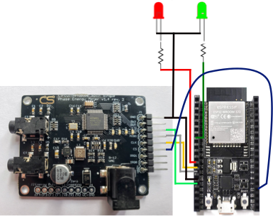
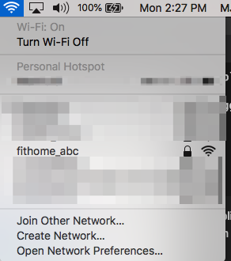
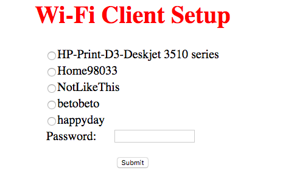

# Thanks to Those That Went Before
There is _so much_ prior work that made it easier to evolve the atm90e32 micropython library.  Efforts include:  
* Tisham Dhar's [atm90e26 Arduino library](https://github.com/whatnick/ATM90E26_Arduino).    
* The [atm90e26 Circuit Python library I wrote](https://github.com/BitKnitting/HappyDay_ATM90e26_CircuitPython).
* Circuit Setup's [atm90e32 Arduino library](https://github.com/CircuitSetup/Split-Single-Phase-Energy-Meter/tree/master/Software/libraries/ATM90E32).
# For Collaborators
We are thrilled you want to collaborate with us on this project.  Welcome!  To get started, please follow the steps outlined [in this medium post on GitHub collaboration](https://medium.com/faun/collaborating-on-github-22fd5886fce).     

[Here is our energy monitor firmware GitHub repository](https://github.com/BitKnitting/energy_monitor_firmware).

Let's use our [issues](https://github.com/BitKnitting/energy_monitor_firmware/issues) section to exchange questions, pass along information, assign tasks, etc.

_PLEASE evolve the documentation if it can be improved. This will benefit us all!_

# The Electricity Monitor
The Electricity Monitor gathers power readings from our breaker box     
and sends these readings to a Raspberry Pi where the readings are stored within a mongo db.  This is an image of our breaker box:  
  
It is located in our garage.  We have two electricity monitors hooked up.  One is the Sense monitor (the red box), the other is this project.  

Breaker boxes can be a scarry place because high voltage runs through.  There is a chance you can kill yourself if you don't know what you are doing.  Or perhaps you know what you are doing but are careless.
## This project
Through the code and this document, our goal is to make it (relatively?) easy for you to put together the hardware/software and start collecting power readings.  Subsequent projects address the Raspberry Pi side of receiving and storing the readings.

# Getting Started - Hardware
The first step is to gather the hardware::
- Two current transformers.
- An energy monitor.
- an ESP32 dev board.
- "standard" DIY proto stuff like LEDs to detect the state our code is in, resistors, wires, and a bread board.

__Let's Go!__
# Start Here
## First
Go to your breaker panel and take two pictures similar to the pictures shown here.  Then post these to our GitHub.  This way, we can learn more about how houses have their electricity installed.  By doing so, we can make this project more robust and accomodating to different installations.
## Second
You'll need to know what your house is wired for.  As we note below, many homes are wired for 100 Amp service.  As a home's electricity use increased, the service increased to 200 Amps.  Read about the characteristics of a CT below and figure out what CT model will work with your power lines.  Send the info on the CT you will be using to GitHub so we can better understand what we are building.

## Current Transformers

Current Transformers (CTs) are our "ears" into how devices are using power within our home.  You can see the CTs on our power line.
  
Each of our lines has two CTs - one white, one blue.  The white ones come with the Sense monitor.  The blue ones are the ones we use for this project.  

The CT model we use is [the SCT-013-000 CT](/https://learn.openenergymonitor.org/electricity-monitoring/ct-sensors/yhdc-sct-013-000-ct-sensor-report).  Our home's power lines are 100A service.  You may have 200A service.  That will require a different CT.

The info below should help you get a better idea of CTs and what works for 100A versus 200A services.

### Installation
Installation is the step where it is important to know that most people would recommend an electrician to install the CTs.  This is because = as you can imagine - the amount of voltage and current pouring through the lines WILL kill you because skin is a great conductor of electricity.

I chose to install the CTs myself.  While my family thought this was foolish, I researched and decided:
- I'm snapping a plastic "thing" (CT) around a heavily cabled line.
- For added protection, I turned off the power before putting on the CTs.  Just to make sure, I double checked the power was off with a voltage detector  
  


Or you can pay an electrician to install.

Your choice.

### Characteristics of the CT
 The characteristics of a CT to be considered when sourcing include:
 * The amount of Amp Service.  This is important because it dictates the hole diameter of the CT.  Many homes are wired for 100 Amp service.  As a homes electricity use increased, the service increased to 200 Amps.[From this article _Understanding Your Home's Electrical Load_](https://www.bhg.com/home-improvement/electrical/how-to-check-your-homes-electrical-capacity/) _Different homes need different amp services. A 60-amp service is probably inadequate for a modern home. A 100-amp service is good for a home of less than 3,000 square feet that does not have central air-conditioning or electric heat. A home larger than 2,000 square feet that has central air-conditioning or electric heat probably needs a 200-amp service._  According to [Bill Thompson of the Open Energy Monitor Project](https://community.openenergymonitor.org/t/ct-hole-diameter-for-north-america/5149), _US homes built before the late 60s were wired with Copper and typically had 100 Amp service, which used AWG 0 copper...Sometime in the late 60s to early 70s, Copper Service Entrance Wires were replaced by Aluminum. Since Aluminum has more resistance per foot than Copper, the equivalent Aluminum wire is two gauges larger than its Copper counterpart. About that same time, 200 Amp service became the norm._  
 * The wire gauge.  The Outside Diameter of the wire gauge determines how large the diameter of the CT clamp must be.  As Bill noted, wires could be copper or aluminum, or copper-clad aluminum.  More aluminum, more current - the wider the diameter.  
   * [100 Amp Service uses 1/0 AWG](https://community.openenergymonitor.org/t/ct-hole-diameter-for-north-america/5149/3) = [12.08 mm](https://lugsdirect.com/Wire_Insulation_Outside_Diameter_Thickness_600V.html).  
   * 200 Amp Service uses (up to?) 2/0 - 4/0 AWG.  [4/0 AWG has an Outside diameter of 16.04mm](https://lugsdirect.com/Wire_Insulation_Outside_Diameter_Thickness_600V.html).  
* Whether the burden resistor is included.  This design assumes the CT __does not__ include the burden resistor.  I.e.: it's output is a current and not a voltage.  
* The ratio of I(in) : I(out)  
* The inclusion of a zener diode.  This is a terrific safety measure to make sure when the CT is clamped on, the circuit is not open.    
# Our Choice of Current Transformers 
 Two Current Transformers (CTs) are needed to get current readings on the two 120V lines.
 ## 100 Amp   
  We'll be using [the SCT-013-000 CT](/https://learn.openenergymonitor.org/electricity-monitoring/ct-sensors/yhdc-sct-013-000-ct-sensor-report) for 100A homes.  It is popular with DIY home energy monitors.  There are two numbers of interest in the [YHDC SCT-013-000 datasheet](http://statics3.seeedstudio.com/assets/file/bazaar/product/101990029-SCT-013-000-Datasheet.pdf):    
* The diameter of the clamp opening - 13 mm  
* The I(OUT) - 50 mA  
As Robert Wall of [the Open Energy Monitor project](https://openenergymonitor.org/) noted to me _...the manufacturer will tweak the number of secondary turns to give the best accuracy overall.  The ratio of a c.t. is __ALWAYS__ specified as a ratio of two currents, the rated primary current to the corresponding secondary current. So your SCT-013-000 is __100 A : 50 mA__._ 
## 200 Amp
TBD: We'll know what to use as the project progresses. 

# Energy Monitor
[CircuitSetup's Split Single Phase Real Time Whole House Energy Meter (v 1.4)](https://circuitsetup.us/index.php/product/split-single-phase-real-time-whole-house-energy-meter-v1-4/) is the breakout board we use.   This breakout board is based on the [ATM90e32 chip](https://www.microchip.com/wwwproducts/en/atm90e32as).

Besides the monitor, the breakout board needs a [9V AC Transformer](https://amzn.to/2t7AUro).  What transformer you use becomes important because there are calibration steps (see the Calibration section below) that require different "numbers" depending on the transformer. 
# An ESP32
We are using [the ESP32 DevKit C](https://amzn.to/2JInYgj).  Another option that looks promising is [Sparkfun's ESP32 Thing](https://www.digikey.com/product-detail/en/sparkfun-electronics/DEV-13907/1568-1444-ND/6419476&).  The Sparkfun board includes an FTDI FT23x, which at this point is the easiest way to get USB going since ESP32 boards lack a "true" USB interface (grrrrr........)

# LEDs and Resisters
We added a green and red LED for easier debugging.  Here's the wiring between the ESP32, LEDs, and Energy Monitor.

 


# Getting Started  

The energy monitor firmware is built on micropython to:
* Join the homeowner's wifi.  
* Send energy readings to the Raspberry Pi.    

## Wiring
The ATM90e32 on the Energy Meter speaks to the ESP32 using the [HSPI pins](https://docs.micropython.org/en/latest/esp8266/quickref.html#hardware-spi-bus):
```
mosi_pin = Pin(13)
miso_pin = Pin(12)
sck_pin = Pin(14)
cs_pin = 15
```
 
In addition to SPI wiring, a red and green led - each with a resistor - are wired:
- red LED on pin 27
- green LED on pin 32
The resistors are between 220 and 1K ohm.
## ESP32 Software
### micropython
 The [micropython binary we used is v1.11](https://github.com/BitKnitting/energy_monitor_firmware/tree/master/micropython_build)  

micropython needs to be installed on your ESP32.  
#### Make sure USB is working
The first hurdle is accessing the ESP32 over USB.  Assuming you don't have Sparkfun's ESP32 Thing...if you open a terminal window and run `ls /dev/tty*` and don't see something like `/dev/tty.SLAB_USBtoUART`, the ESP32 isn't available.  You'll need to install the [CP210x driver](https://www.silabs.com/community/interface/knowledge-base.entry.html/2018/03/30/usb_to_uart_bridgev-Dnef).  

_AND IF YOU DO, PLEASE DOCUMENT YOUR EXPERIENCE IN THE ISSUES SECTION._

#### Add micropython
 - Erase the chip: `esptool.py --chip esp32 -p /dev/tty.SLAB_USBtoUART erase_flash`  
 e.g.:  
 ```
 $ esptool.py -p /dev/cu.SLAB_USBtoUART erase_flash
esptool.py v2.7
Serial port /dev/cu.SLAB_USBtoUART
Connecting...
Detecting chip type... ESP32
Chip is ESP32D0WDQ5 (revision 1)
Features: WiFi, BT, Dual Core, 240MHz, VRef calibration in efuse, Coding Scheme None
Crystal is 40MHz
MAC: bc:dd:c2:d4:58:78
Uploading stub...
Running stub...
Stub running...
Erasing flash (this may take a while)...
Chip erase completed successfully in 9.6s
Hard resetting via RTS pin...
```  
- Flash micropython: `esptool.py  -p /dev/cu.SLAB_USBtoUART write_flash -z 0x1000 esp32-20190529-v1.11.bin`  
e.g.:  
```
$ esptool.py  -p /dev/tty.SLAB_USBtoUART write_flash -z 0x1000 esp32-20190529-v1.11.bin
esptool.py v2.7
Serial port /dev/tty.SLAB_USBtoUART
Connecting........_
Detecting chip type... ESP32
Chip is ESP32D0WDQ5 (revision 1)
Features: WiFi, BT, Dual Core, 240MHz, VRef calibration in efuse, Coding Scheme None
Crystal is 40MHz
MAC: bc:dd:c2:d4:58:78
Uploading stub...
Running stub...
Stub running...
Configuring flash size...
Auto-detected Flash size: 4MB
Compressed 1146864 bytes to 717504...
Wrote 1146864 bytes (717504 compressed) at 0x00001000 in 63.4 seconds (effective 144.8 kbit/s)...
Hash of data verified.

Leaving...
Hard resetting via RTS pin...
```  
Now that we have micropython up and running, it's time to copy over the libraries.
### Libraries
The micropython libraries used by [main.py](https://github.com/BitKnitting/energy_monitor_firmware/blob/master/FitHome_monitor/main.py) reside in the /lib directory of the ESP32.  We need to copy these over.
#### Open a Terminal
Open a terminal at the FitHome_monitor directory location.
#### Install rshell
We use [rshell](https://pypi.org/project/rshell/) to copy files and to run repl.  If rshell isn't installed, run `sudo pip3 install rshell`.  
#### Start an rshell session
```
$ rshell
Welcome to rshell. Use Control-D (or the exit command) to exit rshell.

No MicroPython boards connected - use the connect command to add one
```
#### Attach to the ESP32
Make sure the ESP32 is attached to a USB port.  First, find out what USB port is being used.  The command to do this is `connect serial <USB> <baud rate>`  
  
The command we used within rshel is the first line below:
```
connect serial /dev/tty.SLAB_USBtoUART 115200
Connecting to /dev/tty.SLAB_USBtoUART (buffer-size 512)...
Trying to connect to REPL  connected
Testing if sys.stdin.buffer exists ... Y
Retrieving root directories ... /boot.py/
Setting time ... Sep 30, 2019 11:00:04
Evaluating board_name ... pyboard
Retrieving time epoch ... Jan 01, 2000
```
#### copy micropython Libraries

- cd into the FitHome directory of your cloned/forked project.  It contains [these files](https://github.com/BitKnitting/energy_monitor_firmware/tree/master/FitHome_monitor).
- start an rshell session: `$rshell` and connect to the ESP32 as described above.
- Make lib directory: `mkdir /pyboard/lib`  
- Copy libraries from Mac/PC, e.g.: `cp atm90_e32/atm90e32_registers.py /pyboard/lib`  
The libraries we use to connect to wifi and read/send energy readings include:
  - [atm90e32_registers.py](https://github.com/BitKnitting/energy_monitor_firmware/blob/master/FitHome_monitor/atm90_e32/atm90e32_registers.py) and [atm90e32_u.py](https://github.com/BitKnitting/energy_monitor_firmware/blob/master/FitHome_monitor/atm90_e32/atm90e32_u.py) from workspace/read_monitor.  These libraries wrap interfacing with the atm90e32 over SPI and accessing it's registers.  The [atm90e32's datasheet](https://github.com/BitKnitting/energy_monitor_firmware/blob/master/docs/Atmel-46103-SE-M90E32AS-ApplicationNote.pdf) goes over how to read and write to the registers.  It will be helpful to become acquainted with the contents of this datasheet.
  - [config.py](https://github.com/BitKnitting/energy_monitor_firmware/blob/master/FitHome_monitor/config/config.py) is used to get config values from [config.json](https://github.com/BitKnitting/energy_monitor_firmware/blob/master/FitHome_monitor/config/config.json).  The configuration variables that are used by the micropython libraries include:  
    
```
{
  "ssid": "YOUR_WIFI_SSID",
  "monitor": "monitor_12212019",
  "project_id": "http://192.168.86.209:4001/monitor",
  "password": "YOUR_WIFI_PASSWORD"
}
  
```
If you don't include the ssid and password, the code uses the methods in  
  - [wifi_connect.py](https://github.com/BitKnitting/energy_monitor_firmware/blob/master/FitHome_monitor/join_wifi/wifi_connect.py) will start the wifi code as an Access Point (AP) _See "Setting SSID and password using an Access Point" below_.


__TODO: if you've got this far, try pulling the repo, we should have evolved this document....__
-------------
Under construction.....
___________________

 
  - [send_reading](https://github.com/BitKnitting/energy_monitor_firmware/blob/master/workspace/send_reading/send_reading.py) from workspace/send_reading.
  - [app_error.py](https://github.com/BitKnitting/energy_monitor_firmware/blob/master/workspace/errors/app_error.py) from workspace/errors.


  
The monitor name is created when the homeowner becomes a FitHome member.  The conceptual model is a homeowner becomes a FitHome member for one month.  The homeowner uses the FitHome App to start their month of training.  During this process, one of the available monitors is assigned to the owner.  To uniquely identify this month of use, the monitor name assigned to the homeowner is appended with the date the homeowner signed up for FitHome membership.  In this example, the monitor named "bambi" was assigned to the homeowner.  The homeowner signed up on July 5th, 2019.  

# Powering Up
--------------------->  
Hmmm....a gotcha we haven't debugged yet....In order for the ESP32 to get past boot, the ESP32 __must__ be plugged in __before__ the monitor is plugged in.  
<---------------------
## Software 
 


# Software Design
[main.py](https://github.com/BitKnitting/energy_monitor_firmware/blob/master/workspace/main.py) gives us a general flow of the code.
## Monitor Status
The goal with monitor status is to quickly and simply figure out why we're not getting readings into the db when we think we should be getting them.

Two LEDs - one red (errors) one green (energy reading sent to database) are used to let us the status of the monitor when the code is loading or running.  
### Program Start
The code in [main.py] starts off by blinking the green LED 4 times.  This lets us know that the ESP32 has been able to load and start the code in main.py.  E
### Errors
Errors are identified in [app_error.py](https://github.com/BitKnitting/energy_monitor_firmware/blob/master/workspace/errors/app_error.py) as simply Python classes. e.g.:  
```
class NoMonitor():
    # When the atm class is initialized, it writes calibration info to
    # registers.  This error means the microcontroller couldn't write to
    # the atm.  Most likely the monitor isn't plugged in or the SPI
    # connection isn't working properly.
    number = 301
    explanation = 'Could not contact a monitor.'
    blinks = 1
 ```
 Each error is assigned a number of blinks.  If the red LED starts blinking, we need to check how many blinks happen and then figure  out from there is we can debug why the monitor is not working.
 ### All OK
 Every time a reading is sent to the db, the green light blinks.  If we watch the monitor for a time within which a reading should occur, the green LED should blink.  If it doesn't, there is a really, really good chance readings are not being made or at least not being sent to the db.
 ## Connecting to WiFi
 A big chunk of the firmware code is dedicated to handling wifi.  The monitor either knows the ssid and password of the homeowner's wifi (and of course is close enough to get a usable signal) or does not.  

 From [main.py](https://github.com/BitKnitting/energy_monitor_firmware/blob/master/workspace/main.py):

 - Load the class that will handle all the wifi calls: `from wifi_connect import WifiAccess`
 - Make an instance of the wifi class: `join_wifi = WifiAccess()`
 - Connect to the wifi network: `join_wifi.get_connected()`
 ### Monitor Install
 When the monitor is first installed, the homeowner's wifi ssid and password is not known.  The `__init__` method of the WifiAccess class tries to read the SSID and password using the `read_config` method in [config.py](https://github.com/BitKnitting/energy_monitor_firmware/blob/master/workspace/config/config.py).  If the SSID and password can't be retrieved, the class's wifi_state variable is set to no_ssid_pwd.  If the SSID and password were retrieve, wifi_state is set to not_connected.

 # Setting SSID and password using an Access Point
 _Note: There must be a cleaner way to get the SSID and password!_

 Monitor install focuses on the no_ssid_password state.  When WifiAccess()'s `get_connected()` method figures out the monitor doesn't know the wifi's SSID and password, it moves the code into being a web server acting as a wireless Access Point with the SSID `fithome_abc`.   An Access Point shows up within the Mac's/PC's list of wifi networks.

   
- Connect to the `fithome_abc` Access Point on your Mac/PC.  If you don't see the Access Point and the monitor isn't blinking red, there's a good chance the monitor is too far from the wifi signal.  Right now, we have a poor solution - get the wifi signal to be stronger in the area where the monitor is...hmmm....
- Once connected to `fithome_abc`, open a browser window and enter the address `192.168.4.1`.  At this point, you should be "talking" with the monitor's AP firmware and see a page that shows the SSIDs available in the homeowner's house.

  

Click on the radio button of the SSID the monitor should use and type in the password.  If the monitor can log in, you'll see:    
  
  
Behind the scenes, the code in `wifi_connect.py` is using `<form action="configure"` to figure out if the homeowner has sent the SSID and password.  
```
  try:
      tag = ure.search("(?:GET|POST) /(.*?)(?:\\?.*?)? HTTP",
                        request).group(1).decode("utf-8").rstrip("/")
  except Exception:
      tag = ure.search(
          "(?:GET|POST) /(.*?)(?:\\?.*?)? HTTP", request).group(1).rstrip("/")
  if tag == "":
      # Get the ssid and password.
      self._handle_ssid_pwd_ui(client)
      # Try to join the self.wifi.
  elif tag == "configure":
      self._handle_join_wifi(client, request)
```                    
`_handle_join_wifi()` takes care of adding the SSID and password into the config file in case the monitor's firmware needs it again.  It also connects to the network. _Note: We haven't spent time exploring this, but from what we can tell, the ESP32 stores the SSID and password somewhere (EEPROM? FLASH?).  It doesn't seem to access the variables from the config file, rather can just log in._
### Ongoing wifi
Once the monitor knows the SSID and password, the monitor should be able to connect to the homeowner's wifi.
# Monitor Readings
Reading the atm9e32 registers relies on the [ATM90e32 class](https://github.com/BitKnitting/energy_monitor_firmware/blob/master/workspace/atm90_e32/atm90e32_u.py).  
## Calibration 
The code in main.py shows several values being passed into the initialization of at atm90e32 instance:  
```


ATM90e32(lineFreq, PGAGain, VoltageGain, CurrentGainCT1, 0, CurrentGainCT2)
 ```
The default values are discussed in [Circuit Setup's documentation](https://github.com/CircuitSetup/Split-Single-Phase-Energy-Meter#calibration).  

We use the default values for:  
```
lineFreq = 4485  # 4485 for 60 Hz (North America)
PGAGain = 21     # 21 for 100A (2x), 42 for >100A (4x)
```
What is left to calibrate are the voltage and current gain values.  These are important, because they can cause havoc with the accuracy of the voltage, current, power readings.

It is more likely the voltage readings will need calibration than the current.  
### Voltage Calibration
The gain value is tied to the transformer we are using.  We decided to standardize on the [Jameco 9V power supply, part no. 157041](https://www.jameco.com/shop/ProductDisplay?catalogId=10001&langId=-1&storeId=10001&productId=157041).  The default voltage gain for a 9V AC transformer was 42080.  With this setting for voltage gain, our readings were over 15 watts higher than what the actual voltage was.  

To determine the actual voltage, we used the extremely useful [Kill-A-Watt](https://amzn.to/2Mcjkt7).

To calibrate the voltage gain, we used the formula/info in [the app note](https://github.com/BitKnitting/energy_monitor_firmware/blob/master/docs/Atmel-46103-SE-M90E32AS-ApplicationNote.pdf) _see section 4.2.6 Voltage/Current Measurement Calibration where it discusses using existing voltage gain_

where:
- reference voltage = reading from Kill-A-Watt
- voltage measurement value = the reading for voltage we got from initializing the atm90e32 instance with the voltage gain value and reading the `line_voltageA` property.

new `VoltageGain` = reference voltage/voltage measurement * current voltage gain

e.g. using a different 9V transformer:
- Kill-A-Watt shows V = 121.5
- reading shows voltage at 117.5
- current `VoltageGain` is 36650

new `Voltage Gain = 121.5/117.5*36650 = 37898`

Calculate the value, and change the `VoltageGain` to the calculated value.
### Current Calibration
We found the default current gain gave current readings close to what we got with the Kill-A-Watt.  Because it was easy to do so, we set the `CurrentGainCT1` and `CurrentGainCT2` values to our calculation, using the current readings in place of the voltage readings as discussed in the app note.


## Initializing the ATM90e32 Class
We start by initializing an instance of the ATM90e32 twice with a time delay in between.  We have found that there are times when initializing only once fails to be able to send correct power readings.  We then go into a - hopefully - endless while True loop:
- check the system status register to verify we can "talk" correctly with the atm90e32.
- send a reading to the database.
## Get Readings

### Send Readings
The [SendReadings() class](https://github.com/BitKnitting/energy_monitor_firmware/blob/master/workspace/send_reading/send_reading.py) handles sending power readings to the database.  Given how rich the atm90e32 readings are, there are many different readings we could send back.  We chose to send only power readings since these are the only ones we need to gain and provide insight on a homeowner's energy use.  

The SendReadings() class uses the REST PUT API to send power readings to the FitHome db.  We are currently using Firebase RT.  
  
Each reading is formatted:  
```
<Firebase reference>/readings/<monitor name>/<Unix Epoch timestamp>/
{{"P": 1002.4,"I":12.2}}
```
#### Getting the Timestamp
The path to a power reading in the db includes the Unix Epoch timestamp.  To know what timestamp to use, we must:
* Know the current date/time as a timestamp. 
* Set the ESP32's date/time to the timestamp.  
* Get the timestamp from the ESP32 when sending a power reading and build up the db path.
##### Get the Current date/time from Firebase
We get the current timestamp from the Firebases db.  We do this in [`SendReadings() __init__()`](https://github.com/BitKnitting/energy_monitor_firmware/blob/master/workspace/send_reading/send_reading.py)  
```
path = 'https://fithome-9ebbd.firebaseio.com/current_timestamp/.json'
data = '{ "timestamp":{".sv": "timestamp"} }'
response = requests.put(path, data=data)
```
`response.json()` gives us the Unix Epoch timestamp. `{'timestamp': 1568821802745}`.  We then use micropython's utime library to interpret the date and time.  
##### Set the ESP32 date/time
Now we have the Epoch Unix timestamp.  We need to set the ESP32 to that time.  To do this:
* The Firebase timestamp is in ms.  We need to divide the timestamp by 1000.
* The Firebase timestamp uses a different epoch than the ESP32/micropython timestamp,  as pointed out within [the utime micropython docs](https://docs.micropython.org/en/latest/library/utime.html):
_Time Epoch: Unix port uses standard for POSIX systems epoch of 1970-01-01 00:00:00 UTC. However, embedded ports use epoch of 2000-01-01 00:00:00 UTC._
  We need to subtract out the number of seconds between the Unix and micropython Epoch time: `time_diff = 946684800`.
Using the timestamp from above:
```
import utime
ts = 1568821802745 // 1000
time_diff = 946684800
year,month,day,hour,minute,second, dayofweek,dayofyear = utime.localtime(ts-time_diff)
```
As noted in [the micropython docs](https://docs.micropython.org/en/latest/library/utime.html), "_The current calendar time may be set using machine.RTC().datetime(tuple) function..._"
```
import utime
import machine
rtc = machine.RTC()
# Set the time on the ESP32
rtc.datetime((year,month,day,dayofweek,hour,minute,second,0))
# Check to see if the time is set right.
now = utime.time()
# Ask what the current time is.
tm = utime.localtime(now)
print(tm)
```
Here's an _UGH_ we ran across... notice how `dayofweek` is in the middle of setting the datetime within the rtc instance.  This is different than what the documenation shows.  Looking at [the code](https://github.com/micropython/micropython/blob/master/ports/esp32/machine_rtc.c):
```
mp_obj_new_int(tm.tm_year),
mp_obj_new_int(tm.tm_mon),
mp_obj_new_int(tm.tm_mday),
mp_obj_new_int(tm.tm_wday),
mp_obj_new_int(tm.tm_hour),
mp_obj_new_int(tm.tm_min),
mp_obj_new_int(tm.tm_sec),
mp_obj_new_int(tv.tv_usec)
```
# Send Reading
Recall the last node on the db path to the power readings is created by a timestamp.  We need a string timestamp in Unix Epoch time.  
```
import utime
now = utime.time()
# now is the number of seconds since 2000-01-01... We need to convert tis to the number of seconds since 1970-01-01.
time_diff = 946684800
now_unix = now + time_diff
now_unix_str = str(now_unix)
```
_Note: we could multiply by 1000 to be in the same units as the Firebase timestamp (i.e.: ms).  However, we cannot find a reason to do this.  Since the monitor is the only hardware that doesn't use Unix epoch, it made sense to use Unix epoch without ms._

 


