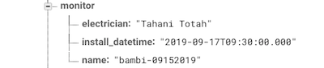

### GitHub Location
[energy monitor firmware GitHub repository](https://github.com/BitKnitting/energy_monitor_firmware)

# Overview
The energy monitor firmware is built on micropython to:
* Join the homeowner's wifi.  
* Send energy readings to the Firebase RT db.  
### Hardware
- Energy Monitor - The firmware was written for [CircuitSetup's Split SIngle Phase Real Time Whole House Energy Meter (v 1.4)](https://circuitsetup.us/index.php/product/split-single-phase-real-time-whole-house-energy-meter-v1-4/).
- Microprocessor - At least for testing, we are using [the ESP32 DevKit C](https://amzn.to/2JInYgj).
### Software 
- OS: [micropython v1.11](https://github.com/BitKnitting/energy_monitor_firmware/tree/master/micropython_build)
- IDE: [uPyCraft](http://docs.dfrobot.com/upycraft/)
#### uPyCraftism
__IMPORTANT__: uPyCraft has a folder in it called _workspace_.  This folder is mapped (mounted) to a directory on the Mac's/PC's hard drive.  This is why the firmware starts below the _workspace_ folder.  This folder needs to be mapped to uPyCraft's folder.  These are the steps we took:
- Choose Tools/InitConfig  You'll be asked if you want to init. Choose yes.  
- Click on the workspace folder.  This brings up a Finder dialog box.  Choose the energy_monitor_firmware directory.

# Software Design
[main.py](https://github.com/BitKnitting/energy_monitor_firmware/blob/master/workspace/main.py) gives us a general flow of the code.
## Monitor Status
The goal with monitor status is to quickly and simply figure out why we're not getting readings into the db when we think we should be getting them.

Two LEDs - one red (errors) one green (energy reading sent to database) are used to let us the status of the monitor when the code is loading or running:
### Errors
Errors are identified in [app_error.py](https://github.com/BitKnitting/energy_monitor_firmware/blob/master/workspace/errors/app_error.py) as simply Python classes. e.g.:  
```
class CalibrationError():
    # When the atm class is initialized, it writes calibration info to
    # registers.  This error means the microcontroller couldn't write to
    # the atm.  Most likely the monitor isn't plugged in or the SPI
    # connection isn't working properly.
    number = 301
    explanation = 'Calibration error.'
    blinks = 1
 ```
 Each error is assigned a number of blinks.  So if the red LED starts blinking, we need to check how many blinks happen and then figure  out from there is we can debug why the monitor is not working.
 ### All OK
 Every time a reading is sent to the db, the green light blinks.  If we watch the monitor for a time within which a reading should occur, the green LED should blink.  If it doesn't, there is a really, really good chance readings are not being made or at least not being sent to the db.
 ## Connecting to WiFi
 A big chunk of the firmware code is dedicated to handling wifi.  The monitor either knows the ssid and password of the homeowner's wifi (and of course is close enough to get a usable signal) or does not.  

 From [main.py](https://github.com/BitKnitting/energy_monitor_firmware/blob/master/workspace/main.py):

 - Load the class that will handle all the wifi calls: `from wifi_connect import WifiAccess`
 - Make an instance of the wifi class: `join_wifi = WifiAccess()`
 - Connect to the wifi network: `join_wifi.get_connected()`
 ### Monitor Install
 When the monitor is first installed, the homeowner's wifi ssid and password is not known.  The `__init__` method of the WifiAccess class tries to read the SSID and password using the `read_config` method in [config.py](https://github.com/BitKnitting/energy_monitor_firmware/blob/master/workspace/config/config.py).  If the SSID and password can't be retrieved, the class's wifi_state variable is set to no_ssid_pwd.  If the SSID and password were retrieve, wifi_state is set to not_connected.

 #### Setting SSID and password

 Monitor install focuses on the no_ssid_password state.  When WifiAccess()'s `get_connected()` method figures out the monitor doesn't know the wifi's SSID and password, it moves the code into being a web server acting as a wireless Access Point with the SSID `fithome_abc`.   An Access Point shows up within the Mac's/PC's list of wifi networks.

   
- Connect to the `fithome_abc` Access Point on your Mac/PC.  If you don't see the Access Point and the monitor isn't blinking red, there's a good chance the monitor is too far from the wifi signal.  Right now, we have a poor solution - get the wifi signal to be stronger in the area where the monitor is...hmmm....
- Once connected to `fithome_abc`, open a browser window and enter the address `192.168.4.1`.  At this point, you should be "talking" with the monitor's AP firmware and see a page that shows the SSIDs available in the homeowner's house.

  

Click on the radio button of the SSID the monitor should use and type in the password.  If the monitor can log in, you'll see:    
  
  
Behind the scenes, the code in `wifi_connect.py` is using `<form action="configure"` to figure out if the homeowner has sent the SSID and password.  
```
  try:
      tag = ure.search("(?:GET|POST) /(.*?)(?:\\?.*?)? HTTP",
                        request).group(1).decode("utf-8").rstrip("/")
  except Exception:
      tag = ure.search(
          "(?:GET|POST) /(.*?)(?:\\?.*?)? HTTP", request).group(1).rstrip("/")
  if tag == "":
      # Get the ssid and password.
      self._handle_ssid_pwd_ui(client)
      # Try to join the self.wifi.
  elif tag == "configure":
      self._handle_join_wifi(client, request)
```                    
`_handle_join_wifi()` takes care of adding the SSID and password into the config file in case the monitor's firmware needs it again.  It also connects to the network. _Note: We haven't spent time exploring this, but from what we can tell, the ESP32 stores the SSID and password somewhere (EEPROM? FLASH?).  It doesn't seem to access the variables from the config file, rather can just log in._
# Ongoing wifi
Once the monitor knows the SSID and password, the monitor should be able to connect to the homeowner's wifi.


 # Preparing the ESP32
 At least for testing, we are using [the ESP32 DevKit C](https://amzn.to/2JInYgj).  For the IDE we are using [uPyCraft](http://docs.dfrobot.com/upycraft/).   
 # Install micropython
- Plug the microprocessor into the Mac's USB port.
- Open uPyCraft on the Mac.
- Check Tools/Build from the menu and make sure ESP32 is checked.
- Check Tools/Serial from the menu and select the SLAB_USBtoUART serial port.  When this is done, the >>> repl command prompt should be seen in the lower window.  
- Go to Tools/BurnFirmware.    [This is the micropython build we currently use](https://github.com/BitKnitting/energy_monitor_firmware/tree/master/micropython_build).  This version of micropython is available within [the energy monitor firmware's GitHub repository](https://github.com/BitKnitting/energy_monitor_firmware/tree/master/micropython_build).  For ESP32 micropython firmware, the settings should be:  
  
Once the fields are filled in, click on OK.  This starts the erase and burn process.   
- uPyCraft disconnects.  Once the microprocessor restarts, go ack to Tools/Select and choose the SLAB_USBtoUSART serial port. 
## Copy micropython Libraries
The libraries we use to connect to wifi and read/send energy readings include:
  - [atm90e32_registers.py](https://github.com/BitKnitting/energy_monitor_firmware/blob/master/workspace/read_monitor/atm90e32_registers.py) and [atm90e32_u.py](https://github.com/BitKnitting/energy_monitor_firmware/blob/master/workspace/read_monitor/atm90e32_u.py) from workspace/read_monitor.
  - [config.py](https://github.com/BitKnitting/energy_monitor_firmware/blob/master/workspace/config/config.py) from workspace/config.
  - [wifi_connect.py](https://github.com/BitKnitting/energy_monitor_firmware/blob/master/workspace/join_wifi/wifi_connect.py) from workspace/join_wifi.
  - [send_reading](https://github.com/BitKnitting/energy_monitor_firmware/blob/master/workspace/send_reading/send_reading.py) from workspace/send_reading.
  - [app_error.py](https://github.com/BitKnitting/energy_monitor_firmware/blob/master/workspace/errors/app_error.py) from workspace/errors.
  ### Steps
  Within the uPyCraft IDE:  
  - Make sure you are "talking" with micropython by checking if the repl >>> prompts are in the bottom window.
  - create a lib file under the device folder.
  - drag/drop each of the lib files from within the workspace folder to the lib directory under the device folder.
  - drag/drop main.py to be under the device folder.
  - create `config.json` and copy it to the lib directory.  The `config.json` file looks like:  
  ```
  {
    "monitor":"bambi-07052019",
    "project_id":"my-firebase-projectid-00989"
}  
```
The monitor name is in the Database under the homeowner's member record.  
 
  
The monitor name is created when the homeowner becomes a FitHome member.  The conceptual model is a homeowner becomes a FitHome member for one month.  The homeowner uses the FitHome App to start their month of training.  During this process, one of the available monitors is assigned to the owner.  To uniquely identify this month of use, the monitor name assigned to the homeowner is appended with the date the homeowner signed up for FitHome membership.  In this example, the monitor named "bambi" was assigned to the homeowner.  The homeowner signed up on July 5th, 2019.


