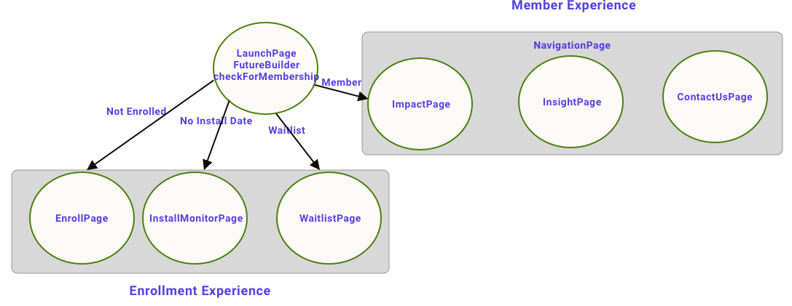
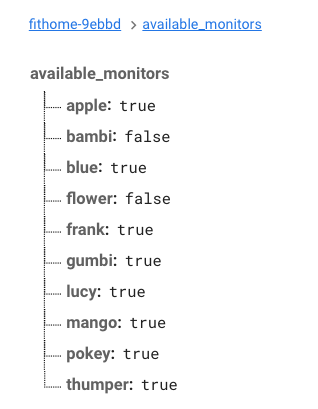
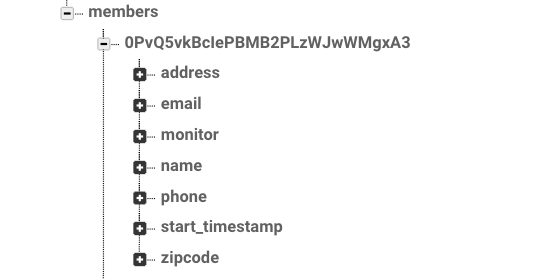

# High Level Code Flow
The first page that gets invoked during launch is the [LaunchPage](https://github.com/BitKnitting/FitHome_app/blob/master/lib/launch_to_impact/launch_page.dart).  
  
  
  
It is within LaunchPage() that [checkMembership()](https://github.com/BitKnitting/FitHome_app/blob/master/lib/launch_to_impact/launch_check.dart) is called.  checkMembership() figures out what state the user is at.  These states include:
- __waitlist__: The Firebase RT db is checked to see if there are any monitors available to check out.  If there are no monitors available,the user is shown the [WaitListPage()](https://github.com/BitKnitting/FitHome_app/blob/master/lib/launch_to_impact/waitlist_page.dart). 

Here is an image of the available monitors tree in Firebase:  
  
This image shows the monitor named apple is available.  The monitor named bambi is not available.
- __enroll__: The user does not have an account in Firebase.  There is a monitor available.  The user is shown the [EnrollPage()](https://github.com/BitKnitting/FitHome_app/blob/master/lib/launch_to_impact/enroll_page.dart).  Once the user fills out the info on the page, they tap the "Schedule an Electrician" button.  An account is created, the user's info is stored in Firebase.  
  
Each member is uniquely identified by the UID created for them when the Firebase account was created.  
