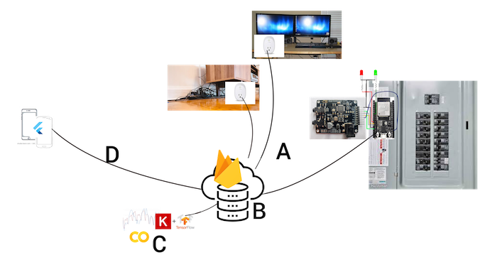

# Contact
contact@fithome.life

# Welcome
 
  
Welcome to the FitHome Wiki.  During a one month training period, the homeowner gets personalized, simple guidance on the easiest way to lower electricity consumption by at least 15%. The homeowner receives immediate feedback, including the amount of money you are saving and your impact on helping to minimize climate change. It's amazing how much electricity we waste yet don't have any idea how we can use less with no change to our lifestyle. Saving electricity means saving money and making a positive impact on climate change. The FitHome Experience gets us mindful and connected to a future that is reliant on renewable energy.

# High Level System Components

## (A and B) Electricity Monitors to DB
Monitors send readings  to a Firebase RT db (B).  
  
The electricity monitoring hardware includes:
- An [electricity monitor](https://github.com/BitKnitting/FitHome/wiki/ElectricityMonitor) within a homeowner's breaker box.  
- A [PlugE device](https://github.com/BitKnitting/FitHome/wiki/PlugE) within the home.
- One or more [TP-Link HS110 Smart Plugs](https://amzn.to/2MFSVmH). 
  
## (C) Analysis
A backend service scoops up the electricity readings.  It uses data analytics and deep learning to provide personalized insights to the homeowner.
## (D) FitHome App
The [FitHome App](https://github.com/BitKnitting/FitHome/wiki/FitHomeAppExperienceFlow) gives the busy homeowner insights into how to quickly and painlessly lower the amount of electricity they use.  We wrote the app in Flutter so that it would run on both iPhone and iOS devices.
### The Impact Screen
The Impact Screen lets the homeowner know at a glance how lowering their use of electricity is making an impact.  
  
  
#### Info Section
The screen highlights:  
- The average amount of daily electricity used prior to engaging with Fithome. 
- The average amount of daily electricity they are currently using.
- The percentage of electricity they have saved since engaging with Fithome.
- The equivalent CO2 emissions per barrel of crude oil.
The background image is associated with what CO2 equivalency is being shown.  The screen rotates between CO2 equivalency values for gasoline, oil, and trees (sequestration of CO2) as well as money the homeowner saves.
#### Plot Section
The plot section shows real time power readings taken at 5 second intervals.
### The Insight Screen
The insight screen guides the homeowner through a detailed analysis on how they are consuming electricity based on four categories.  
  
  

The homeowner is invited to tap on one of the tiles to start an electricity lowering exercise.  A good place to start is fixing leaks.

