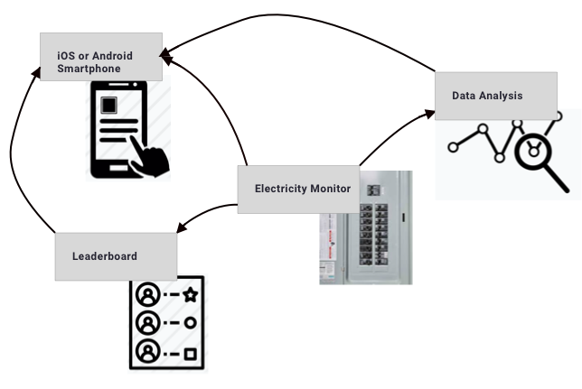

# Contact
contact@fithome.life

# Welcome 
Welcome to the FitHome Wiki.  FitHome is a one month home training experience that makes it fun and easy for busy homeowners to lower their electricity consumption by at least 15%.  FitHome uses software and hardware to provide the homeowner with immediate feedback, personalized advice, and community involvement.  After one month, the homeowner no longer needs a trainer.  They have evolved their understanding of their use of electricity to continue saving electricity and being more aware of the impact of our choices on effecting climate change.

# At A High Level
## Electricity Monitor
The [Electricity Monitor](ElectricityMonitor.md) sends the home's power readings to the __FitHome app__ running on an iOS or Android SmartPhone.  The FitHome app provides realtime feedback on the impact the homeowner's electricity use choices is having on:
- How much money is being saved.
- How much CO2 is being saved by noting the equivalent gas, oil consumed as well as trees planted.

  
The FitHome app provides the user with:
- Personalized insights about what can be easily done to lower the electricity use by analyzing the power readings (__Data Analysis__).  
- A __leaderboard__ so the homeowner can see how well they are doing conserving energy compared to the rest of the FitHome community.
 