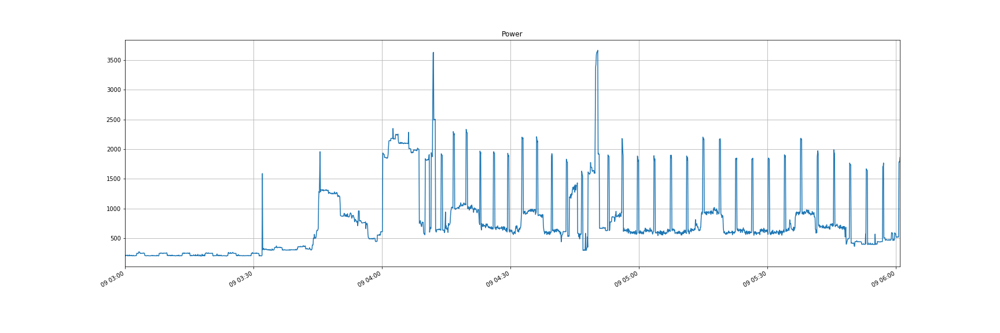
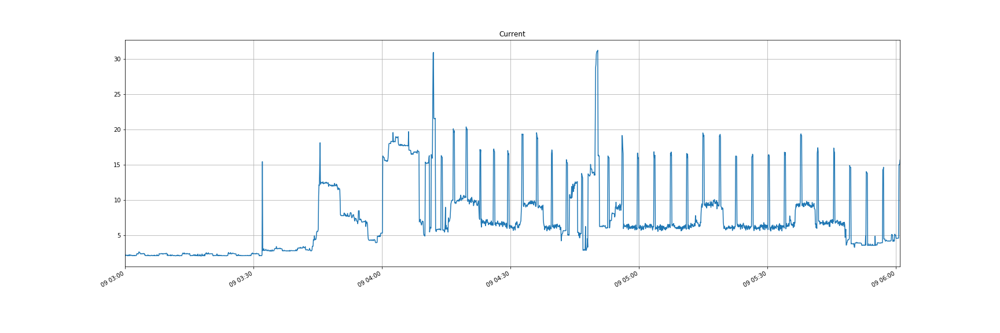

November 19th, 2019

# Exploring Energy Disaggregation
Wouldn't it be terrific if we can show the homeowner how and when their appliances are slurping up electricity?  
  
  
_From a [Bridgely White Paper](https://www.bidgely.com/wp-content/uploads/2016/04/White_Paper_Savings__Engagement_v2_Case_Study.pdf)_

Much smarter minds are working on this challenge.  Yet, in our usual enthusiam we ask ourselves _"How Hard Can it be?"_ As we bumble along early answers include _"As Hard as you make it!"_, _"Why isn't more of this Open Source instead of an Academic Paper?"_, and our personal favorite _"Hmmmm...what the heck, is this right, really?_"

...So let's get this learning exploration started by bumbling our way to an answer to the question
  
__Given:__
- five second readings of whole house current, real power, and reactive power...
- five second readings of our microwave taken at the same time as the whole house current...

__can we build a Deep Learning model that takes future aggregated electricity readings and tell us when the microwave was on and off, as well as how much of the aggregate electricity is being used by the microwave?__

We're hoping the answer to this question follows the sentiment of the NY,NY song..._if I can make it there I can make it anywhere_...
# A Bothering Question
We have:
- aggregated (whole house) data in which readings mask what appliance is on because several appliances are on at the same time. It reminds us of a restaurant where we strain to hear what is being said.  Yet we can figure out what really loud folks are saying at other tables!  
  
  

A Few Hours of Power Readings
 
  
  
  

A Few Hours of Current Readings
  

    
  

A Few Hours of Current and Power

